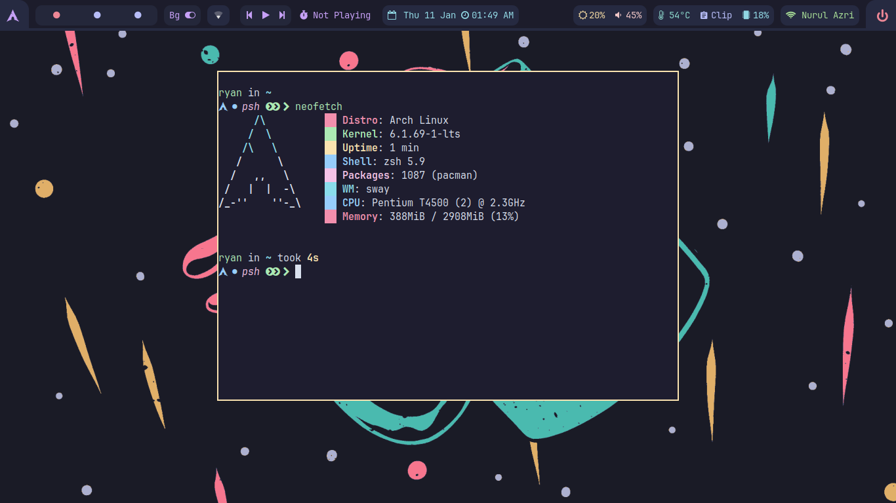
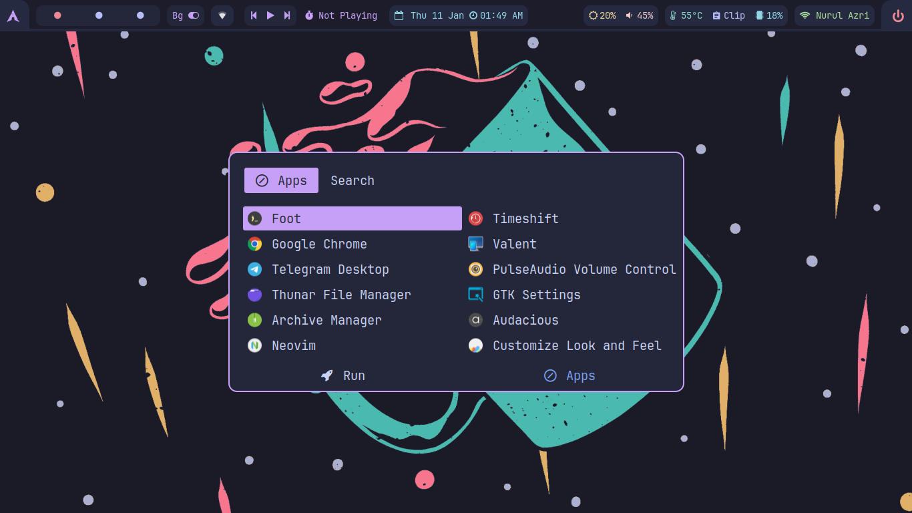
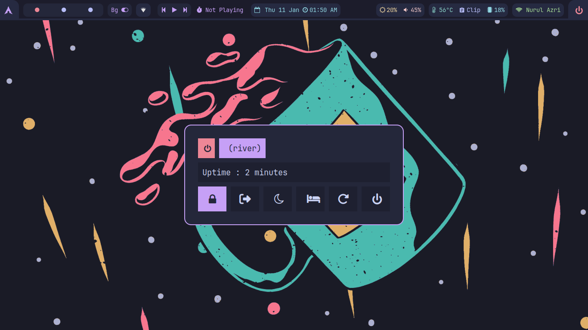
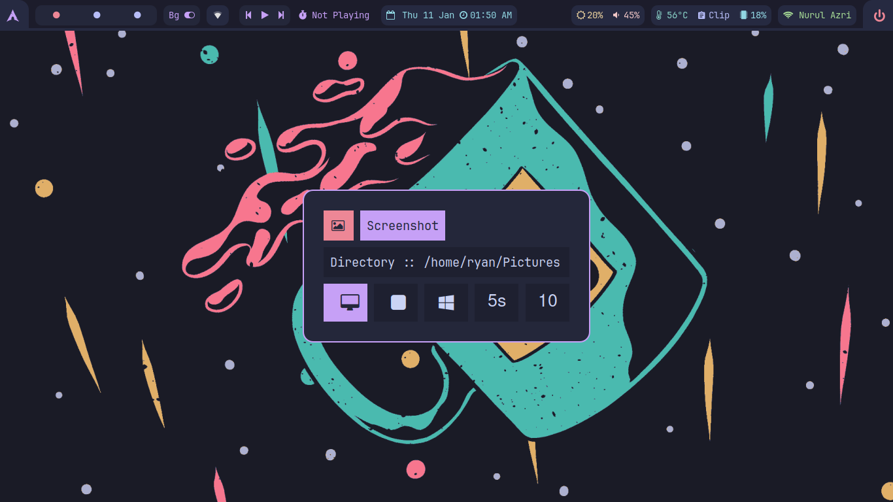

# River-WM Dotfiles

## 🔥 Information

|    Distro    |                 [Archlinux](https://archlinux.org/)                 |
| :----------: | :-----------------------------------------------------------------: |
|      WM      |              [River](https://github.com/riverwm/river)              |
|   Terminal   |               [Foot](https://codeberg.org/dnkl/foot)                |
|    Shell     | [zsh+zap](https://www.zapzsh.org/)-[starship](https://starship.rs/) |
|   Launcher   |            [Rofi Wayland](https://github.com/lbonn/rofi)            |
|  Clipboard   |           [Cliphist](https://github.com/sentriz/cliphist)           |
| File Manager |                               thunar                                |

## 🖼️ Gallery









## 💣 Setup Installation

1.- <b>First clone the repository</b>

```sh
https://github.com/hidayry/riverwm-dotfiles.git
```

2.- <b>Copy config :</b>

- **⚠️ WARNING: Configuration files may be overrided,please backup your config**

```sh
cd riverwm-dotfiles
cp -r .config/* ~/.config/
cp -r home/* ~/
```

3.- <b>Install Dependencies</b>

Dependencies :

```sh
sudo pacman -S --needed river swaybg jq findutils waybar mpd ncmpcpp swayidle wf-recorder dmenu brightnessctl mako cliphist grim slurp pamixer polkit-gnome starship xdg-user-dirs xdg-utils gvfs gvfs-mtp gvfs-nfs wl-clipboard playerctl foot network-manager-applet grimshot
```

- **aur-packages**

```sh
yay -S --needed tela-circle-icon-theme-manjaro tokyonight-gtk-theme-git wl-clipboard-history-git ttf-jetbrains-mono-nerd mpdris2 rofi-lbonn-wayland swaylock-effects nwg-look rivercarro
```

- **zap zsh**

```sh
zsh <(curl -s https://raw.githubusercontent.com/zap-zsh/zap/master/install.zsh) --branch release-v1
```

for zap zsh in this [link](https://github.com/zap-zsh/zap)

<table align="center">
   <tr>
      <th align="center">
      </th>
   </tr>
   <tr>
      <td align="center">

    💻 Dotfiles Configured at 1360x768 with 96 DPI on 1 monitor

   </tr>
   </table>
